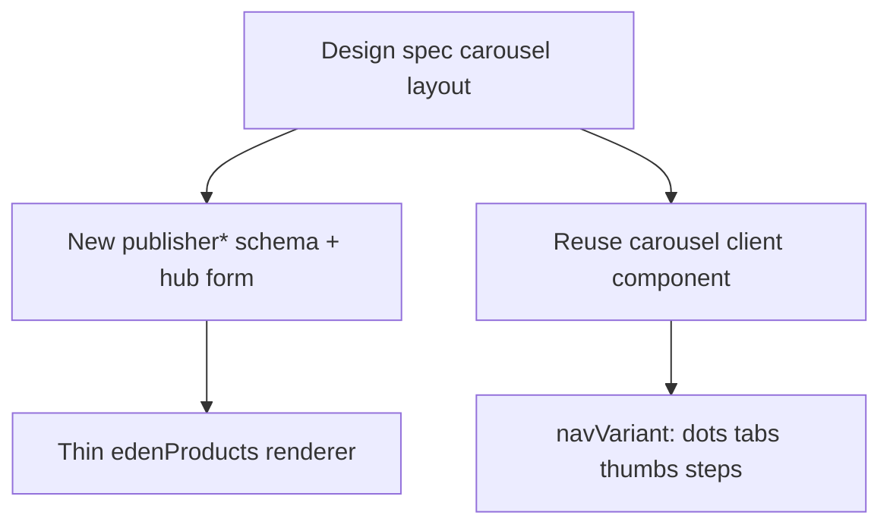

# Carousel reuse — publisher panels

Load **before** carousel-like publisher panel impl.

## Why "not built" existed

Some carousel layouts lacked dedicated `publisher*` `_type`, hub form, renderer. **Not** reason to build carousel UI from scratch.

## Reuse strategy

1. **UI:** extend existing carousel primitives with `navVariant` — no parallel carousel stack
2. **Schema:** dedicated `publisher*` `_type` when content shape differs (images-only vs mixed media vs step labels)
3. **Hub form:** slides/steps in form; drag-reorder from `PublisherImage300x300V2Form` or `MultiMediaCarouselForm`

## Existing bases

| Base | Location | Best for |
|------|----------|----------|
| `storefront/client/carousel` | `packages/ui` | Generic Embla carousel |
| `storefront/client/multimedia-carousel` | `packages/ui` | Main + thumbnail strip |
| `multiMediaCarousel` panel | API + hub + `MultiMediaCarouselRender` | Mixed resource types (org pages) |
| `PublisherImageGrid` | `packages/ui` | Fixed image grids (not carousels) |

### multiMediaCarousel (org pages)

- Schema: `api/.../multiMediaCarousel.ts` — discriminated `mediaItems[]`
- Hub: `MultiMediaCarouselForm.tsx` — drag-reorder + resource pickers
- Renderer: `MultiMediaCarouselRender.tsx` → hydrate → `Carousel` client

Publisher carousels: **images/assets only**, fixed dims from design spec, `panelProducts` scope. Copy **architecture** (schema → form → renderer → client carousel), not org-resource union.

## navVariant

`dots` | `tabs` | `thumbs` | `steps` — ascii layouts in `wireframes.md` §4.

One shared publisher carousel component (e.g. `PublisherMediaCarousel`) with `navVariant` prop — not four separate UI folders.

## Do not

- Resurrect deleted `publisherImageGallery` (thumb strip only) — carousels cover interactive switching
- New Embla wrapper when `storefront/client/carousel` or `multimedia-carousel` already covers behaviour
- `multiMediaCarousel` `_type` for product publisher content — wrong scope + schema shape

## When new publisher carousel justified

- Design spec shows swipe/tab/step navigation
- Content product-scoped (`panelProducts`)
- Slide schema images ± text per spec (not org events/jobs/products mix)

## Impl order (carousel panel)

1. `publisher*Carousel` schema (slides array, `navVariant` enum)
2. Hub form — slide list + image fields per slide
3. Extend/compose client carousel with `navVariant`
4. Storybook per nav variant
5. `Publisher*CarouselRenderer` → `c360PanelComponents`
6. Update `publisher-panels.md` mapping
