# Generate Sanity Panels — Activity Diagram

Stage labels show **In** inputs and **Out** outputs. Gates show optional `userFeedback`.

```mermaid
flowchart TD
    Start([Start]) --> UserInput

    UserInput["In: clarify outline\ntarget + brief + domain\n+ target requirements"]

    subgraph S1 [1 Definition]
        DomainPick["In: domain pick"]
        DomainPick --> TargetPick["In: target pick + requirements"]
        TargetPick --> DefRun["In: target brief domain productId?\nProcess: template spine domainSnapshot"]
        DefRun --> DefOut["Out: definitionBundle domainSnapshot template"]
    end

    UserInput --> DomainPick
    DefOut --> GateDef

    GateDef{"Gate Def\nIn: definitionBundle userFeedback?\nOut: approved bundle"}
    GateDef -->|edit| DefRun
    GateDef -->|ok| S2In

    S2In["In: definitionBundle"]

    subgraph S2 [2 Personas]
        PersonasRun["Process: 3-6 personas"]
        PersonasOut["Out: personas[]"]
        S2In --> PersonasRun --> PersonasOut
    end

    PersonasOut --> GatePer

    GatePer{"Gate Per\nIn: personas userFeedback?\nOut: approved personas"}
    GatePer -->|edit| PersonasRun
    GatePer -->|ok| S3In

    S3In["In: personas brief domain"]

    subgraph S3 [3 Research Strategy]
        StratRun["Process: generate topics"]
        StratOut["Out: topics[]"]
        S3In --> StratRun --> StratOut
    end

    StratOut --> GateStrat

    GateStrat{"Gate Strat\nIn: topics userFeedback?\nOut: approved topics"}
    GateStrat -->|edit| StratRun
    GateStrat -->|ok| S4In

    S4In["In: topics brief domainSnapshot"]

    subgraph S4 [4 Research Findings]
        TopicAgents["Subagent per topic\nOut: findings slice"]
        AlgoliaAgent["Algolia subagent\nOut: products slice"]
        MergeFind["Merge\nOut: findings[] products[]"]
        S4In --> TopicAgents
        S4In --> AlgoliaAgent
        TopicAgents --> MergeFind
        AlgoliaAgent --> MergeFind
    end

    MergeFind --> GateFind

    GateFind{"Gate Find\nIn: findings products userFeedback?\nOut: approved findings"}
    GateFind -->|edit| S4In
    GateFind -->|ok| S5In

    S5In["In: target brief personas findings products"]

    subgraph S5 [5 Desired Content]
        ContentRun["Process: editorRole structure no _types"]
        ContentOut["Out: desiredPageContent"]
        S5In --> ContentRun --> ContentOut
    end

    ContentOut --> GateContent

    GateContent{"Gate Content\nIn: desiredPageContent userFeedback?\nOut: approved content"}
    GateContent -->|edit| ContentRun
    GateContent -->|ok| S6In

    S6In["In: desiredPageContent"]

    subgraph S6 [6 Media]
        MediaRun["Process: style refs charts generate"]
        MediaOut["Out: pageWithMedia"]
        S6In --> MediaRun --> MediaOut
    end

    MediaOut --> GateMedia

    GateMedia{"Gate Media\nIn: pageWithMedia userFeedback?\nOut: approved media"}
    GateMedia -->|edit| MediaRun
    GateMedia -->|ok| S7In

    S7In["In: pageWithMedia target template domainSnapshot"]

    subgraph S7 [7 Draft]
        SchemaRun["fetch_schema allowlist + gallery"]
        MapPanels["Map content to panels max 2 same _type"]
        McpPatch["MCP patch draft"]
        DraftOut["Out: draftPatch previewUrl panelsUsed[]"]
        S7In --> SchemaRun --> MapPanels --> McpPatch --> DraftOut
    end

    DraftOut --> GateDraft

    GateDraft{"Gate Draft\nIn: draftPatch previewUrl userFeedback?\nOut: approved draft"}
    GateDraft -->|edit| MapPanels
    GateDraft -->|ok| S8In

    S8In["In: previewUrl draftPatch"]

    subgraph S8 [8 Audit]
        AuditPreview["Open previewUrl scroll screenshot"]
        AuditCheck["Deterministic checklist JSON + preview"]
        AuditOut["Out: auditResult checklist previewEvidence"]
        S8In --> AuditPreview --> AuditCheck --> AuditOut
    end

    AuditOut --> GateAudit

    GateAudit{"Gate Audit\nIn: auditResult"}
    GateAudit -->|fail| DefFail["Restart Definition\nIn: auditFlags"]
    DefFail --> DefRun
    GateAudit -->|pass| S9In

    S9In["In: draftPatch explicit user yes"]

    subgraph S9 [9 Publish]
        PublishRun["MCP publish_documents"]
        PublishOut["Out: publishedId"]
        S9In --> PublishRun --> PublishOut
    end

    PublishOut --> End([End])
```

## I/O summary

| Stage | In | Out |
|---|---|---|
| Definition | `target`, `brief`, `domain` (+ `productId` if product) | `definitionBundle`, `domainSnapshot`, `template` |
| Gate Def | prior + `userFeedback?` | approved bundle |
| Personas | `definitionBundle` | `personas[]` |
| Research Strategy | `personas`, `brief`, `domain` | `topics[]` |
| Research Findings | `topics[]`, `brief`, `domainSnapshot` | `findings[]`, `products[]` |
| Desired Content | `target`, `brief`, `personas`, `findings`, `products` | `desiredPageContent` |
| Media | `desiredPageContent` | `pageWithMedia` |
| Draft | `pageWithMedia`, `target`, `template`, `domainSnapshot` | `draftPatch`, `previewUrl`, `panelsUsed[]` |
| Audit | `previewUrl`, `draftPatch`, `pageWithMedia` | `auditResult` (checklist + previewEvidence) |
| Publish | `draftPatch` + user yes | `publishedId` |
