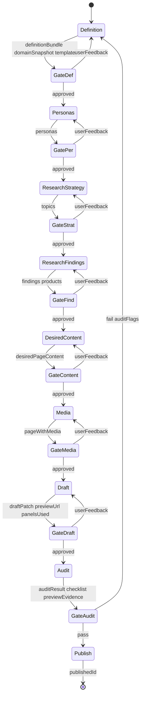

# Generate Sanity Panels — State Machine

Each state = one subagent stage. Orchestrator validates artifact on transition. User gate after every stage.

## States

| State | Subagent ref | Output artifact |
|---|---|---|
| Definition | `constants/domains/{D}.md` + `constants/targets/{T}.md` + `references/1-definition/` | `definitionBundle`, `domainSnapshot`, `template` |
| Personas | `references/2-personas/` | `personas[]` |
| ResearchStrategy | `references/3-research-strategy/` | `topics[]` |
| ResearchFindings | `references/4-research-findings/` (+ `algolia.md` when catalogue) | `findings[]`, `products[]` |
| DesiredContent | `references/5-desired-content/` | `desiredPageContent` |
| Media | `references/6-media/` | `pageWithMedia` |
| Draft | `references/7-draft/` + `mcp-sanity.md` | `draftPatch`, `previewUrl`, `panelsUsed[]` |
| Audit | `references/8-audit/` | `auditResult` (checklist + preview evidence) |
| Publish | `references/9-publish/` | `publishedId` |

Gates are orchestrator-only — no subagent ref. Each gate: In = prior artifact + optional `userFeedback`; Out = approved handoff or same-stage restart.

## Load protocol (orchestrator)

| When | Load |
|---|---|
| Domain picker | `constants/domains/_index.md` only |
| After domain `D` | `constants/domains/{D}.md` once at Definition |
| Target picker | `constants/targets/_index.md` only |
| After target `T` | `constants/targets/{T}.md` + `references/{N}-*/shared.md` + `{T}.md` per stage |
| Stage N (N≥2) | stage refs + prior artifact JSON path |

**Forbidden:** all `constants/domains/*`, all targets, unrelated stage refs. Stages 2–9 use `domainSnapshot` from artifact.

## Gate reject / iterate

| Gate | Reject restarts |
|---|---|
| GateDef | Definition + `userFeedback` |
| GatePer | Personas + `userFeedback` |
| GateStrat | ResearchStrategy + `userFeedback` |
| GateFind | ResearchFindings + `userFeedback` |
| GateContent | DesiredContent + `userFeedback` |
| GateMedia | Media + `userFeedback` |
| GateDraft | Draft + `userFeedback` |
| GateAudit fail | Definition + `auditFlags` |

## Hard constraints (draft + audit)

- Draft id prefix `drafts.` until Publish
- Max 2 identical panel `_type` per page
- Never `markdown` panel `_type`
- Generated/custom panel art = Sanity refs; catalogue covers = picker IDs (no re-upload)
- Never preview on `www.eden.co.uk`
- Audit requires browser preview + deterministic checklist — no pass without `previewEvidence`

I/O vars per transition: [activity-diagram.md](activity-diagram.md).
