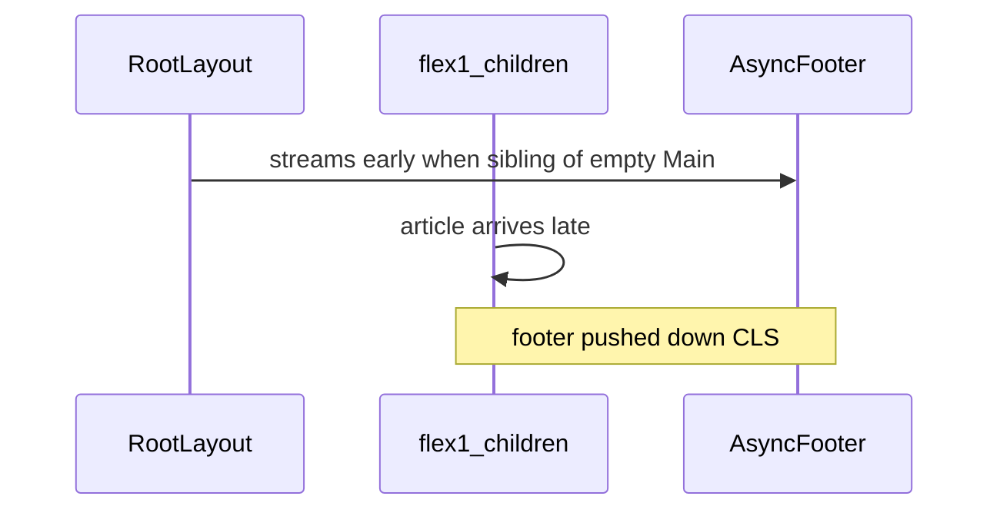

# Appendix — Eden fleet footer CLS

Optional. Use when CLS culprit is `<footer>` / TrustPilot and stream-order grep confirms chrome before main shell.

Fleet apps: `v0-template`, `eden-blog`, forks. Packages: `@eden-ecommerce/common` 0.3.6+, `@eden-ecommerce/lib` 0.2.7+.

## Root cause (eden-blog article, Jul 2026)

CLS ~0.79 — footer streamed before article; nested `<footer>`; unsized body images.



## Layout fix

```tsx
// app/layout.tsx — good
<div className="flex min-w-0 flex-1 flex-col overflow-x-clip">
  {children}
  <SanityFooter />
</div>
```

- No outer `<footer>` — common `Footer` already renders `<footer>`
- Footer **after** `{children}` in same flex column

## SanityFooter pattern

```tsx
export function SanityFooter() {
  return (
    <Suspense fallback={<SanityFooterLoading liveFooter={null} />}>
      <SanityFooterServer />
    </Suspense>
  );
}
```

- Single `getFooter()` — not duplicate async boundaries
- Sync `SANITY_FOOTER_DEFAULTS` in Suspense fallback

## Loading shells

```tsx
export function ArticlePageLoading() {
  return (
    <div className="min-h-dvh w-full" aria-busy="true" aria-label="Loading article">
      <main className="mx-auto w-full min-w-0 max-w-3xl px-4 py-16 sm:px-6">
        {/* pulse blocks */}
      </main>
    </div>
  );
}
```

Wire via segment `loading.tsx`. Parent `Suspense` fallback when `useSearchParams()` etc.

## Images (fleet)

- `AspectRatioImage` in PortableText — no bare `h-auto` on body images
- Footer badges: `h-[70px] w-[220px] object-contain`
- `ImageLoader.intrinsicSize` in common; lib `imageWidth` / `imageHeight` in mappers

## common 0.3.6+

- `TrustPilotReviews` — `min-h-[420px] sm:min-h-[280px]`
- `FooterInfo` — `min-h-[70px]` around image slot

## Fleet checklist

- [ ] Footer inside `flex-1` column after `{children}`
- [ ] Single `SanityFooter` + Suspense defaults
- [ ] Route `loading.tsx` with `min-h-dvh`
- [ ] Article images — aspect-ratio reservation
- [ ] Bump common 0.3.6 + lib 0.2.7
- [ ] CLS Playwright < 0.1 on slow route

## Verify

Stream order: `min-h-dvh` before `#preFooter` in curl. Post-fix CLS ~0.019 on throttled article (Playwright).

Reference: `next-next-eden` `BaseLayout` — footer after page content resolves.
